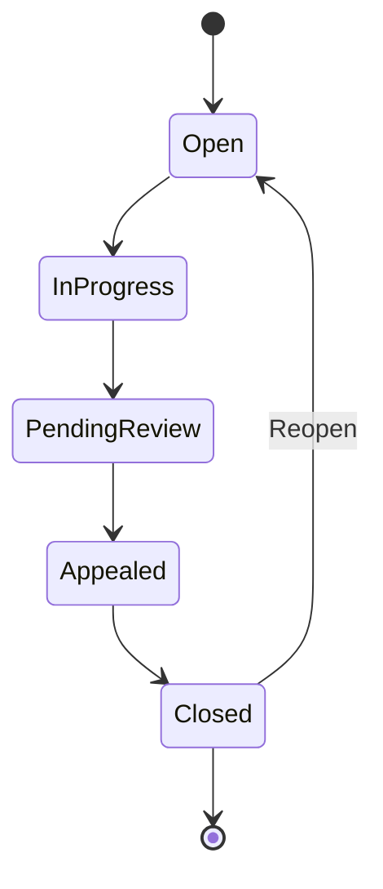
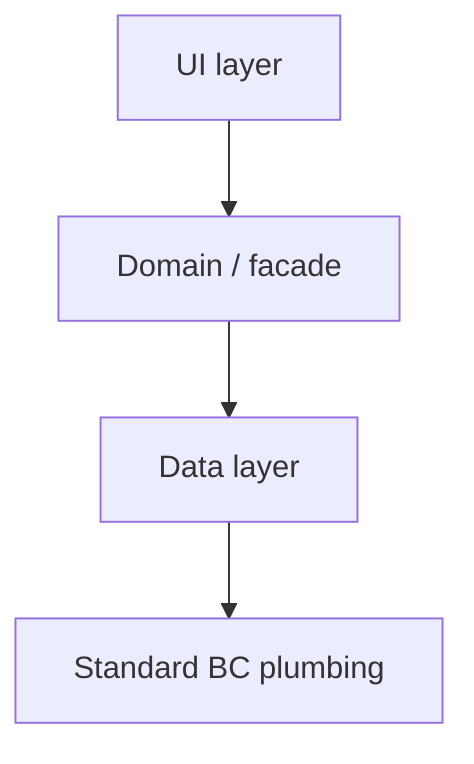
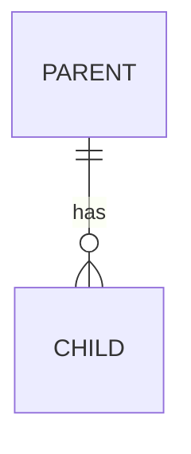
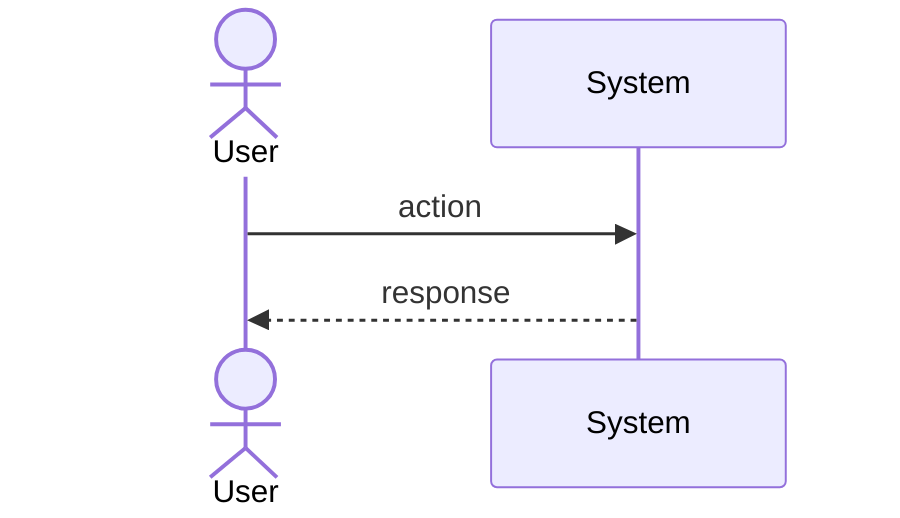

<!-- PLAN-DOC-BC-003 heading rules: H2s must NOT carry a manual numeric prefix (template auto-numbers) and MUST NOT end with a source-ID suffix like '(from US-NNN)'. H3 subsection labels keep the 'N.M ' prefix shape but translate the label text. See SKILL.md "Heading & full-content translation rules". -->
# CCN Template Skeleton

This file is a placeholder-tokenised skeleton used by the `documentation-bc-ccn-generator` skill. Section headings, ordering, frontmatter keys, §1 Header field labels, table column headers, diagram marker attributes, and the verdict tokens (`GO` / `CONDITIONAL-GO` / `NO-GO`) are **byte-stable and always in canonical English** so the downstream `md-to-docx-converter` Word template and JSON extraction keys bind identically regardless of the target content language.

**Translation rule:** when the skill is invoked with `language ≠ en`, translate ONLY the natural-language content — prose paragraphs, list-item text, table cell values, the leading blockquote under the H1, SWOT body text, risk descriptions / mitigations, advisories, and free-text §1 values such as `Client`. Do NOT translate: H1/H2/H3 headings, YAML keys, §1 field labels, table column headers, diagram markers, identifier values (`CCN-NNN`, `US-NNN`, `SPEC-NNN`, `ARCH-NNN`, `ANALYSIS-NNN`), dates, version numbers, enum values (`Pending Approval`), or the verdict token in §9.

**Section-key anchors:** every H2 in this skeleton is immediately followed by an HTML-comment anchor of the form `<!-- section-key: <CanonicalKey> -->`. These anchors are **byte-stable, language-neutral, CCN-number-neutral** and are the contract between this skill and the `md-to-docx-converter`. They map each section to a fixed placeholder key (`{{Header}}`, `{{BusinessContext}}`, `{{ProposedSolution}}`, `{{Architecture}}`, `{{FeasibilityAnalysis}}`, `{{TimeEstimate}}`, `{{TestingSetup}}`, `{{TestingSteps}}`, `{{Recommendation}}`, `{{Approvals}}`) inside the Word template, regardless of the visible H2 text or content language. Keep the anchors verbatim — do NOT translate, renumber, or remove them.

Replace every `<...>` token. Drop any frontmatter line or section paragraph marked _(optional — include only if …)_ when its source artefact is absent or the interview answer excludes it.

---

```yaml
---
id: CCN-<NNN>
title: Change Control Note — <Title>
version: 1.0
status: Pending Approval
client: <Client>
dsd_ticket: TBD
user_story: US-<NNN>
spec: SPEC-<NNN>
architecture: ARCH-<NNN>          # (optional — include only if ARCH exists)
analysis: ANALYSIS-<NNN>          # (optional — include only if ANALYSIS exists)
prepared_by: <Author>
date: <YYYY-MM-DD>
recommendation: <GO | CONDITIONAL-GO | NO-GO>
related_docs:
  - openspec/userstories/US-<NNN>-<kebab>.story.md
  - openspec/specs/SPEC-<NNN>-<kebab>.spec.md
  # - openspec/architecture/ARCH-<NNN>-<kebab>.architecture.md   (optional)
  # - openspec/analysis/ANALYSIS-<NNN>-<kebab>.analysis.md       (optional)
template: 5_CCN_Template.docx
language: en
---
```

# CCN-<NNN> — <Title>

> Formal change-control note for the **<Title>** module to be delivered inside the `<extension-name>` Business Central extension for <Client>. This document consolidates the approved user story ([US-<NNN>](../../openspec/userstories/US-<NNN>-<kebab>.story.md)), the technical specification ([SPEC-<NNN>](../../openspec/specs/SPEC-<NNN>-<kebab>.spec.md)), the architecture rationale ([ARCH-<NNN>](../../openspec/architecture/ARCH-<NNN>-<kebab>.architecture.md)), and the feasibility analysis ([ANALYSIS-<NNN>](../../openspec/analysis/ANALYSIS-<NNN>-<kebab>.analysis.md)) into a single stakeholder-facing artefact. <One-line statement: which monetary / hour data is included or excluded, echoing the interview answer.>

---

## Header
<!-- section-key: Header -->

> §1 field **labels MUST be bold-wrapped** so the downstream metadata extractor (`md-to-docx-converter`) recognises them. Values MUST be plain text — no markdown links inside the table cells, no backticks, no em-dashes, no Spanish accents on labels.

| Field | Value |
|---|---|
| **CCN ID** | CCN-<NNN> |
| **Title** | <Title> |
| **Client** | <Client> |
| **DSD ticket** | TBD |
| **BC environment** | <On-premises / SaaS / both> |
| **BC version baseline** | <BC X.Y (runtime Z.W)> |
| **Extension affected** | <extension-name> (publisher <Publisher>, prefix <PFX>, id range <from-to>) |
| **Source user story** | US-<NNN> (approved <YYYY-MM-DD>) |
| **Source spec** | SPEC-<NNN> (approved <YYYY-MM-DD>) |
| **Architecture** | ARCH-<NNN> |
| **Analysis** | ANALYSIS-<NNN> |
| **Prepared by** | <Author> |
| **Date** | <YYYY-MM-DD> |
| **Status** | Pending Approval |
| **Recommendation** | <GO / CONDITIONAL-GO / NO-GO> |

---

## Business context
<!-- section-key: BusinessContext -->

Drawn from [US-<NNN>](../../openspec/userstories/US-<NNN>-<kebab>.story.md).

### 2.1 Who
<Role / persona>

### 2.2 What they want
<One-paragraph "I want …" restatement>

### 2.3 Why
<One-paragraph "so that …" restatement>

### 2.4 Objective
<Single-sentence objective>

### 2.5 Functional scope
1. <bullet 1>
2. <bullet 2>
…

### 2.6 Acceptance criteria (US-<NNN> summary)

| # | Topic |
|---|---|
| AC01 | <topic> |
| …  | … |

### 2.7 Out of scope (Phase 1)
<comma-separated list>

### 2.8 Future enhancements (noted)
<comma-separated list>

---

## Proposed solution
<!-- section-key: ProposedSolution -->

Drawn from [SPEC-<NNN>](../../openspec/specs/SPEC-<NNN>-<kebab>.spec.md).

### 3.1 Design principles
1. <principle 1>
2. <principle 2>
…

### 3.2 AL object inventory

| Type | ID | Name | Purpose |
|---|---|---|---|
| <Table/Enum/Page/PageExt/Codeunit/PermSet> | <id> | <Name> | <Purpose> |

**Totals**: <N new objects, M modified AL objects, K modified translation files>.

### 3.3 Number series
<one paragraph>

### 3.4 API surface
<one paragraph or "N/A">

### 3.5 Localisation
<source lang → target lang(s), toolchain>

### 3.6 Open-question resolutions (US-<NNN>)
<bullets mapping OQ-01, OQ-02, … to resolution status>

### 3.7 Delivery in <N> phases

| Phase | Scope |
|---|---|
| 1 | <scope> |
| 2 | <scope> |
| … | … |

<!-- DIAGRAM: mermaid type="stateDiagram" name="status-lifecycle" -->
Open → In Progress → Pending Review → Appealed → Closed   (+ explicit Reopen)

<!-- /DIAGRAM -->

---

## Architecture solution
<!-- section-key: Architecture -->

Drawn from [ARCH-<NNN>](../../openspec/architecture/ARCH-<NNN>-<kebab>.architecture.md).

> _(If ARCH not yet available, replace this whole section with: "Architecture document not yet available — section derived from SPEC only.")_

### 4.1 Architecture Decision Records (summary)

| ADR | Decision | Why |
|---|---|---|
| ADR-1 | <decision> | <rationale> |
| …  | … | … |

### 4.2 Logical component view

<!-- DIAGRAM: mermaid type="flowchart" name="component-view" -->
```
<ASCII component view copied verbatim from ARCH §4.2 — optional, for human readers only>
```

<!-- /DIAGRAM -->

### 4.3 Cross-cutting concerns

| Concern | Approach |
|---|---|
| Security | <…> |
| Reliability | <…> |
| Performance | <…> |
| Observability | <…> |
| Localisation | <…> |
| RapidStart / portability | <…> |
| Upgrade / migration | <…> |

### 4.4 Coexistence with legacy code
<one paragraph or "N/A — greenfield">

### 4.5 Known constraints

| # | Constraint | Mitigation |
|---|---|---|
| C-1 | <constraint> | <mitigation> |
| …  | … | … |

<!-- DIAGRAM: mermaid type="erDiagram" name="entity-relationship" -->
```
<ASCII ER / table relations copied verbatim from ARCH §6.1 — optional, for human readers only>
```

<!-- /DIAGRAM -->

<!-- DIAGRAM: mermaid type="sequenceDiagram" name="flow-<short-name>" -->
```
<ASCII runtime flow copied verbatim from ARCH §5 — optional, for human readers only>
```

<!-- /DIAGRAM -->

---

## Feasibility analysis
<!-- section-key: FeasibilityAnalysis -->

Drawn from [ANALYSIS-<NNN>](../../openspec/analysis/ANALYSIS-<NNN>-<kebab>.analysis.md).

> _(If ANALYSIS not yet available, replace this whole section with: "Feasibility analysis not yet available — §5 and §6 are intentionally omitted.")_

### 5.1 Change summary
<bullets — new objects count by type, modified count, legacy-untouched statement, LoC estimate, ID-range usage>

### 5.2 SWOT

**Strengths** — <prose>

**Weaknesses** — <prose>

**Opportunities** — <prose>

**Threats** — <prose>

### 5.3 Risk register

| # | Risk | Likelihood | Impact | Mitigation |
|---|---|---|---|---|
| R-01 | <risk> | <Low/Medium/High> | <Low/Medium/High> | <mitigation> |
| …  | … | … | … | … |

**Overall risk rating: <LOW | LOW–MEDIUM | MEDIUM | MEDIUM–HIGH | HIGH>.**

### 5.4 Open-question status
<one-paragraph wrap-up>

---

## Time estimate
<!-- section-key: TimeEstimate -->

> Rendering depends on the interview answers:
> - `include_hours = no` → replace this entire section with: `_Effort and duration intentionally omitted from this version of the document._`
> - `include_hours = yes`, `include_costs = no` → render §6.1 and §6.2 only; strip any EUR columns.
> - `include_hours = yes`, `include_costs = yes` → render §6.1, §6.2, and §6.3 (Cost). State the EUR/h rate verbatim from ANALYSIS.
> - One column per selected scenario in `scenarios` (Optimistic / Expected / Pessimistic / Neutral).

### 6.1 Effort per phase

| Phase | Scope | <Scenario 1> (h) | <Scenario 2> (h) | … |
|---|---|---:|---:|---|
| 1 | <scope> | <h> | <h> |   |
| … | … | … | … |   |
| — | **Base subtotal** | **<h>** | **<h>** |   |
| — | Contingency (<%> across phases) | **+<h>** | **+<h>** |   |
| — | **Total** | **≈ <h>** | **≈ <h>** |   |

### 6.2 Calendar duration

| Item | <Scenario 1> | <Scenario 2> | … |
|---|---|---|---|
| Development working days | <d> | <d> |   |
| Review working days | <d> | <d> |   |
| **Total working days** | **<d>** | **<d>** |   |
| **Wall-clock duration** | **≈ <weeks>** | **≈ <weeks>** |   |

### 6.3 Cost
_(Only when `include_costs = yes`.)_

Rate: **EUR <rate> / hour** (verbatim from ANALYSIS).

| Scenario | Total hours | Total cost (EUR) |
|---|---:|---:|
| <Scenario 1> | <h> | <EUR> |
| <Scenario 2> | <h> | <EUR> |
| … | … | … |

### 6.4 Assumptions
<bullets — developer familiarity, test strategy, exclusions, review cycles, master-data readiness, third-party costs>

---

## Testing setup (planned)
<!-- section-key: TestingSetup -->

| Phase | Test coverage |
|---|---|
| 1 | <coverage> |
| … | … |

Each phase exits only when its dedicated test codeunit (where applicable) is green and the manual smoke checklist is signed off.

---

## Testing steps (acceptance, executed by <Client>)
<!-- section-key: TestingSteps -->

1. <manual step derived from AC01>
2. <manual step derived from AC02>
…

---

## Recommendation
<!-- section-key: Recommendation -->

### **<GO | CONDITIONAL-GO | NO-GO>**

<one paragraph justifying the verdict, citing technical complexity, additive-vs-invasive nature, scope-creep risk, expected value>

### Non-blocking advisories at kick-off
1. <advisory 1>
2. <advisory 2>
…

_(If verdict = `CONDITIONAL-GO`, insert `### Pre-conditions` numbered list above the advisories.)_

---

## Approvals
<!-- section-key: Approvals -->

| Role | Name | Decision | Date | Signature |
|---|---|---|---|---|
| <Client> — Product Owner | — | ☐ Approved · ☐ Rejected · ☐ Changes requested | — | — |
| <Vendor> — Technical Lead | — | ☐ Approved · ☐ Rejected · ☐ Changes requested | — | — |
| <Vendor> — Project Manager | — | ☐ Approved · ☐ Rejected · ☐ Changes requested | — | — |

> Once all three approvals are recorded, the Architect may flip the phase plans in `openspec/plans/` from `not-started` to `approved` and hand off Phase 1 to the AL Developer.