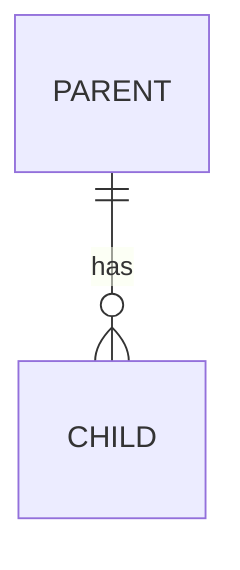

<!-- PLAN-DOC-BC-003 heading rules: H2s must NOT carry a manual numeric prefix (template auto-numbers) and MUST NOT end with a source-ID suffix like '(from US-NNN)'. H3 subsection labels keep the 'N.M ' prefix shape but translate the label text. See SKILL.md "Heading & full-content translation rules". -->
---
id: SPEC-NNN
title: <Title from approved user story>
version: 1.0.0
type: features
status: draft
user_story: US-NNN
priority: <High | Medium | Low>
complexity: <Low | Medium | Medium-High | High>
estimated_effort: <N-M dev days>
module: <Module(s) from US>
prefix: <Affix>
id_range: <from>-<to>
created_date: <YYYY-MM-DD>
approved_date: ""
template: 2_Spec_Template.docx
language: en
---

# SPEC-NNN – <Title>

## User Story Reference
<!-- section-key: UserStoryReference -->

- Source: [US-NNN — <Title>](../userstories/US-NNN-<kebab-title>.userstory.md)
- Product Owner: <Name>
- Status when spec was drafted: approved on <YYYY-MM-DD>

> **As a** <role>
> **I want** <capability>
> **so that** <business value>

All Acceptance Criteria of US-NNN are addressed in §7 of this document.

## Technical Design Overview
<!-- section-key: TechnicalDesignOverview -->

### 2.1 Design Principles

| # | Principle | Rationale |
|---|-----------|-----------|
| 1 | <principle> | <why> |

### 2.2 Architecture

### 2.3 Out-of-Scope Confirmation

The following items from US-NNN remain explicitly out of scope of this spec:

- <item>

## AL Object Inventory
<!-- section-key: AlObjectInventory -->

### 3.1 Tables

| ID | Object Name | Purpose |
|----|-------------|---------|
| <id> | `<Affix> <Name>` | <purpose> |

### 3.2 Enums

| ID | Object Name | Purpose |
|----|-------------|---------|

### 3.3 Pages

| ID | Object Name | Page Type | Source Table |
|----|-------------|-----------|--------------|

### 3.4 Page Extensions

| ID | Object Name | Extends |
|----|-------------|---------|

### 3.5 Codeunits

| ID | Object Name | Purpose |
|----|-------------|---------|

### 3.6 Permission Sets

| ID | Object Name | Scope |
|----|-------------|-------|

### 3.7 Number Series

| Code | Description | Used by |
|------|-------------|---------|

### 3.8 ID Allocation Summary

| Range | Type | Status |
|-------|------|--------|
| <from>-<to> | <type> | Used / Reserved |

## Table Field Definitions
<!-- section-key: TableFieldDefinitions -->

### 4.1 Table <id> — `<Affix> <Name>`

| Field No. | Field Name | Data Type | Length / Properties | Notes |
|-----------|------------|-----------|---------------------|-------|

**Keys:**
- <key>

**Triggers:**
- <trigger>

## Page Design Notes
<!-- section-key: PageDesignNotes -->

### 5.1 Page <id> — `<Affix> <Name>`

- Layout: <groups, repeater, factboxes>
- Actions: <list>
- Visibility / promotion: <notes>

## Integration with Standard BC Objects
<!-- section-key: IntegrationWithStandardBC -->

| Standard Object | Interaction |
|-----------------|-------------|
| `Codeunit "No. Series"` | <how> |

## Technical Acceptance Criteria
<!-- section-key: TechnicalAcceptanceCriteria -->

| ID | Description | Maps to US-AC |
|----|-------------|---------------|
| AC-TBL-001 | <description> | US-NNN / AC1 |
| AC-FLD-001 | <description> | US-NNN / AC1 |
| AC-PAGE-001 | <description> | US-NNN / AC2 |
| AC-CU-001 | <description> | US-NNN / AC3 |
| AC-PERM-001 | <description> | US-NNN / AC10 |
| AC-LANG-001 | All captions/labels translated in `translations/*.xlf` | All |

## Phase Overview
<!-- section-key: PhaseOverview -->

| Phase | Slug | Name | Effort (dev days) | Description |
|-------|------|------|-------------------|-------------|
| 1 | master-data | Master Data & Setup | <n> | <desc> |
| 2 | core | Core Entity & UI | <n> | <desc> |
| 3 | integration | Standard BC Integration | <n> | <desc> |
| 4 | polish | Permissions, Translations & Tests | <n> | <desc> |

**Total estimated effort:** <N-M dev days>

## Testing Strategy
<!-- section-key: TestingStrategy -->

- Phase 1: `test/<feature>/<Feature>SetupTests.Codeunit.al` — <what>
- Phase 2: `test/<feature>/<Feature>CoreTests.Codeunit.al` — <what>
- Phase 3: `test/<feature>/<Feature>IntegrationTests.Codeunit.al` — <what>
- Phase 4: smoke tests + translation sanity check via NAB AL Tools.

## Dependencies
<!-- section-key: Dependencies -->

| Dependency | Source | Resolution |
|------------|--------|------------|
| <dep> | <module / app> | <how resolved> |

## Open Questions Tracking
<!-- section-key: OpenQuestionsTracking -->

| # | From | Status | Resolution proposed in this spec |
|---|------|--------|----------------------------------|
| OQ-01 | US-NNN | <Resolved / Not blocking / Escalated> | <text> |

## Phase Plans
<!-- section-key: PhasePlans -->

1. [Phase 1 — Master Data & Setup](../plans/<kebab-title>-phase-1-master-data.plan.md)
2. [Phase 2 — Core Entity & UI](../plans/<kebab-title>-phase-2-core.plan.md)
3. [Phase 3 — Standard BC Integration](../plans/<kebab-title>-phase-3-integration.plan.md)
4. [Phase 4 — Polish, Permissions & Translations](../plans/<kebab-title>-phase-4-polish.plan.md)